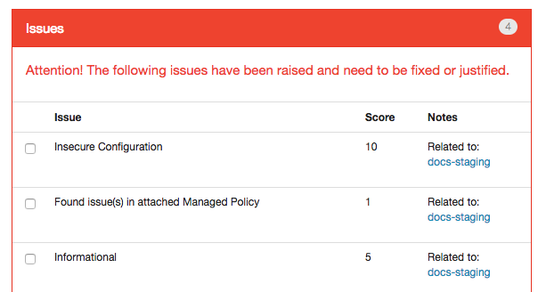

# the Justice Engine
The Judge and Jury custom alerter for Security Monkey.

## What is the Justice Engine?
The Justice Engine is a custom alerter for the [Neflix Security Monkey Project](https://github.com/Netflix/security_monkey). It was designed to be used in parallel with [Krampus](https://github.com/sendgrid/krampus) to flag specific AWS resources for removal.

## Contents
- [Overview](#overview)
  - [FAQ](#faq)
- [Installation](#installation)
  - [Dependencies](#dependencies)
  - [AWS Resources](#aws-resources)
  - [Configuration](#config)
  - [Environment Variables](#env)
  - [Whitelisting Resouces](#whitelist)
  - [Alerting](#alerting)
- [Usage](#usage)
- [Troubleshooting](#troubleshooting)
- [Contributing](#contribute)
- [About](#about)
- [Licensing](#license)

## Overview

Custom Alerters in Security Monkey extend the custom_alerter metaclass and are provided with a list of auditor items so that your custom alerter can perform actions.
These actions are performed by the Security Monkey Worker instances within Security Monkey.

The Justice Engine works as a custom Alerter by iterating through these audit results and actioning them. Specifically:

1. Scoring the item that was audited. 
2. Comparing it against a threshold.
3. Mapping the audited resource to a specific AWS resource that Krampus can Action.
4. Storing these items that need to be actioned externally.
5. Notifying owners of those resources to be actioned.

The Structure of the Justice Engine is as follows:

The Current Version of the Justice Engine is able to run on the most recent changes for Security Monkey.
Namely commit [b174a705124f12aeee612f9ef93820f2b4227e0e](https://github.com/Netflix/security_monkey/tree/b174a705124f12aeee612f9ef93820f2b4227e0e) from Jun 15, 2018. As newer changes are released, breaking changes can be introduced. However, we intend to keep the Justice Engine compatible with the [Develop branch of Security Monkey.](https://github.com/Netflix/security_monkey/tree/develop)

### FAQ

#### There are always edge cases. What stops this from marking critical infrastructure for deletion?

Resources can be whitelisted by placing their ARN within the whitelist file [described in the Configuration.](#whitelist)

#### A lot of these issues that Security Monkey flags are not relevant to my organization. What can I do to change that?

If the existing scores for Security Monkey don't appear to be of value to your organization you can always modify the values of the existing scores within Security Monkey's UI. Setting scores to **0** will still show the issue to users, however it will not be calculated within the Justice Engine. Disabling audit issues will prevent them from appearing to consumers of SecurityMonkey and the Justice Engine.

If there is a specific configuration that you are interested in you can make your own custom watchers to categorize and standardize the data, as well as custom alerters to apply a score to specific configurations. Documentation on this process can be found in the Netflix Security Monkey repository:

* [custom watcher docs](https://github.com/Netflix/security_monkey/tree/develop/docs/development.md#adding-a-watcher)
* [custom auditor docs](https://github.com/Netflix/security_monkey/tree/develop/docs/development.md#adding-an-auditor)
* [custom alerters](https://github.com/Netflix/security_monkey/tree/develop/docs/misc.md#custom-alerters)

## Installation

To install the Justice Engine within Security Monkey we have the following method
that requires an scp into a running instance of the security monkey worker.

First build a distribution of the Justice Engine:

    ./mkdist

which creates Justice-Engine.zip containing the files required to install the Justice Engine within Security Monkey

Secondly, move the file to your SecurityMonkey Worker instance:

    scp Justice-Engine.zip <SECMONKEY_HOST>:<PATHTOSECURITYMONKEY>/Justice-Engine.zip
    ssh <SECMONKEY_HOST>
    cd <PATHTOSECURITYMONKEY>
    unzip Justice-Engine.zip -d justice

Finally, invoke the install script:

    cd justice && ./setup

### Dependencies
The requirements to build the Justice Engine are included within the justice-engine-requirements.txt
file. It's recommended to have these installed within a local virtual environment that can be
sourced locally for development. To create this, we recommend virtualenv. To create the
virtual environment you can perform the following:

    virtualenv --python=python2.7 venv

Now, source the environment:

    source venv/bin/activate

And finally install the dependencies:

    pip install -r justice-engine-requirements.txt

### AWS resources
The Justice Engine requires AWS resources to run.
Terraform modules exist to ensure that these resources exist on your profile.

To run Terraform

    cd terraform
    terraform init
    terraform get

There exists a variables.tf file that can be modified to change resource names.
Change these values to match your desired config, such as choosing the role name, bucket name, etc.

Ensure that the changes that are to be applied are correct.

    terraform plan

If everything looks good, go ahead and apply the changes to your infrastructure.

    terraform apply

### Configuration

#### Environment Variables
The configuration for Justice Engine is performed with environment variables at runtime.
Given the numerous ways that one can deploy the SecurityMonkey service, the only stipulation
is that the expected variables must be in the environment where the security monkey worker
is instantiated.

The [config-template.env](config-template.env) shows the required environment variables to be updated
with your AWS credentials.

Notably, the values that will need the most tuning based upon your organization's
needs are the KILL_THRESHOLD and the DISABLE_THRESHOLD which determine the score
that needs to be met or exceeded for Krampus to disable or remove a resource. This number is
the result of summing the issue scores within an item.

e.g.

Would result in a score of **16** as none of the issues are justified.

The KILL_RESPONSE_DELTA and DISABLE_RESPONSE_DELTA are values that are added to the
current unix timestamp to determine when an action is to take place. Setting these
values results in the amount of time you are providing the resource owners to mitigate
their issues before actioning their resources.

e.g.

    KILL_RESPONSE_DELTA = 86400
    # All tasks scoring at or above the KILL_THRESHOLD are actioned 24 hours after being audited
    DISABLE_RESPONSE_DELTA = 0
    # All tasks scoring at the DISABLE_THRESHOLD up to but not including the KILL_THRESHOLD
    # are actioned the next time Krampus runs.

#### Whitelisting resources
A whitelist exists for resources not to be flagged for removal. It's not intended to
justify resource issues as that functionality already is respected for the Justice
Engine's scoring.

The whitelist file is expected to exist within the bucket containing your tasks file and
your mapping file. An example whitelist can be found [here](docs/example-whitelist.json).

It's formatted to look for ARN values of resources you never want to
be flagged for removal, and a human-readable string identifying what that resource is
and why it's whitelisted.

eg:

    {"whitelist":
      {
        "arn:aws:iam::123456789012:role/engineering-foo": "Foo resource"
      }
    }

The whitelist also supports [Unix-style wildcards](http://www.tldp.org/LDP/GNU-Linux-Tools-Summary/html/x11655.htm)

eg:

    {"whitelist":
      {
        "arn:aws:ec2:*:*:*": "All EC2 Resources",
        "arn:aws:*::123456789012:*": "All Resources for account 123456789012"
      }
    }

For more information about the standards for AWS ARNs you can read more in the [official documentation](https://docs.aws.amazon.com/general/latest/gr/aws-arns-and-namespaces.html).

#### Reporting
Reporting from the Justice Engine is performed via handlers actioning work within the same celery queue the workers, auditors and alerters use.
This requires a modification to the [alert_scheduler](Justice-Engine-source/security_monkey/task_scheduler/alert_scheduler.py) to include the scheudling of alerting.

We currently have a HipChat and SendGrid alerter available, which can be setup and customized to report based upon the most recent items audited from the Justice Engine. These files exist in

    security_monkey/security_monkey/export/krampus_alerters/

and these handlers neccesarily extend the [alerter_abs](Justice-Engine-source/security_monkey/task_scheduler/alert_scheduler.py)

To Enable and Disable these reporters one can specify the classes of the alerters they want to run within the "ENABLED_ALERT_HANLDERS" environment variable.

The alerting mechanism also helps in mapping specific resources to specific owners via AWS account. This can be configued within the mapping.json file.

e.g.

    [
      {
        "AccountName": "prod_website",
        "AccountNumber": "012345678912",
        "ContactEmail": "prodfolks@example.com",
        "HipChatRoom": 31337,
      },
      ...
    ]

would notify "prodfolks@example.com" for all resources that are in account "012345678912"
and similarly would nofity within the Hipchat room "31337" to the prod folks.

an existample mapping file [can be found in the docs](docs/example-mapping.json).

If this file does not exist all alerts from the Justice Engine will be sent to the default rooms specified within the config.

## Usage
The general usage of the Justice Engine is handled through the regular workflow of Security Monkey.

Namely:

* Invoke SecMonkey Watcher to find changes in AWS services.
* Invoke Auditors to find potential security issues from watcher findings.
* Invoke SecMonkey Alerters to perform actions from auditor findings.

Given that the Justice engine is an Alerter, it should be invoked during the regular usage of Security Monkey.

## Troubleshooting
The Justice Engine uses the Security Monkey logger for reporting. Therefore most of the logs related to its
function are available within the logs created for Security Monkey. This defaults to /var/log/security_monkey/securitymonkey.log

Given that the regular function of the Justice Engine includes alerting, the logs generated by regular usage are sparse.
Updating this can be done by raising the logging level of Security Monkey in its config.

## Contributing
Contributions are always welcome and appreciated. Please see the [contribution guidelines](CONTRIBUTING.md) for more information.

## About
The Justice Engine is developed and maintained and funded by the SendGrid Information Security team within SendGrid, Inc.

## License
[The MIT License (MIT)](LICENSE)
